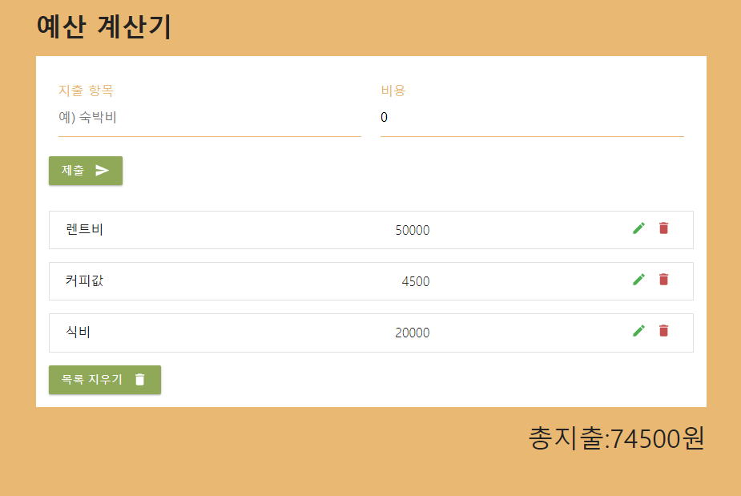

 
 

<h2 align="middle">예산 계산기</h2>

리액트로 예산 계산기 구현하기

  
  
  
  
  

## 🔥 Project!

  

  <a href="https://K-Y-Hoo.github.io/React-practice">🖥️ 데모 링크</a>

## 🎯 기능

- 지출 항목과 비용을 입력하여 제출 버튼을 누르면 항목이 목록에 추가됩니다.
- 펜 모양 버튼을 눌러서 항목의 내용을 수정하고, 수정 버튼을 누르면 수정된 항목이 목록에 추가됩니다.
- 휴지통 모양 버튼(삭제 버튼)을 눌러서 개별적인 항목을 제거할 수 있습니다.
- 목록 지우기 버튼을 눌러서 전체 항목을 제거할 수 있습니다.
- 항목 추가, 삭제, 수정, 경고 상황에 맞는 알림창이 3초간 팝업됩니다.
 

## 📄 참고 사항
- 지출 항목과 비용을 반드시 입력해야만 추가 및 수정이 가능하며, 비용은 0보다 큰 값을 입력해야 합니다.

 
